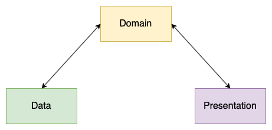
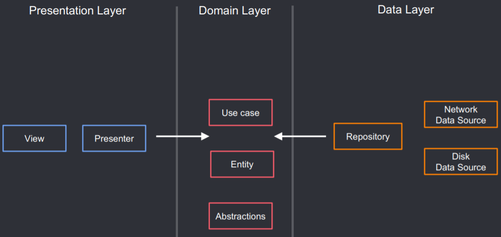

# Single Module

Flutter-based project, implementing the clean-architecture on the app module and some multi-package
as a tools.

## Getting Started

### 1. Setup your Flutter Environment

Since I'm working on a mac machine, what you need is to install HomeBrew first, then you need to
install Flutter Version Manager (FVM) on your machine:

```shell script
brew tap leoafarias/fvm
brew install fvm
```

After you install Flutter Version Manager, you need to install Flutter SDK using FVM, FVM is a very
helpful tool for managing different flutter versions on multiple projects:

```shell script
fvm install
fvm use 3.0.0 --force
```

Why use `--force`? Because we need to set FVM on a non-flutter root directory since we are moving
all of our Flutter modules inside another package.

```
bash make_project.sh
```

### 2. Setup your IDE

Basically, I'm an Android Developer, my main weapon is Android Studio, which is an Intellij IDE. So
if you are using Visual Studio code, you can adjust or contribute to this readme file. What you need
is to set up the SDK location inside the IDE since you will see your entire project showing
compilation errors when you opening the project first time. To resolve this, below are some steps:

1. Open the preferences, or you can just press `command` + `,`.
2. Go to Languages & Frameworks, then select Flutter.
3. Open the Flutter SDK path dropdown.
4. Select a shortcut folder provide by FVM: `flutter_boilerplate/.fvm/flutter_sdk`
5. Apply and restart your IDE.

### Architecture & Rule of Layering

Basically, there is 3 types of layer following the famous uncle Bob's clean architecture, which are
Data, Domain, and Presentation layer.

Below is the outline of the architecture showing the communication for between each layer:



As you can see image above, the project used simple clean-architecture, the project not use
uni-direction flow (data >> domain >> presentation) on the clean-architecture to avoid verbose code,
so the domain will be acting as a middleman between data and presentation layer (data >><< domain >><< presentation), 
there's several rules:

1. The data layer consist of repository and some repositories. Repositories are responsible to
   coordinate data from the different Data Sources such as location updates, preferences, databases,
   or something like remote config. Data Layer depends on Domain Layer.
2. The domain layer consist of use-cases, some interface as contract between data and domain layer,
   and entities. The domain didn't depends with the others layer, it will act as middleman between
   data and presentation.
3. The presentation contains UI (Activities & Fragments) that are coordinated by
   Presenters/ViewModels which execute 1 or multiple Use cases. Presentation Layer depends on Domain
   Layer, but to consume domain the data layer need to be initialized inside the presentation.
   

